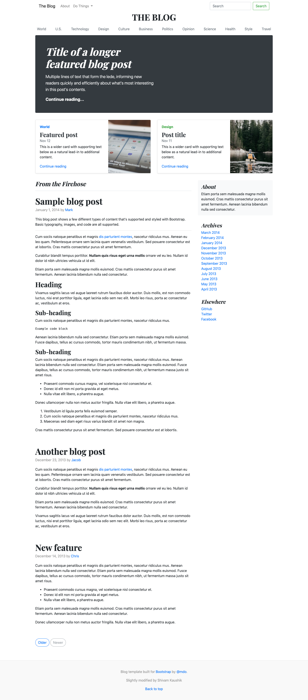

# [Bootstrap practise](https://rawcdn.githack.com/KaushikShivam/bootstrap_blog_practise/94a174f94624b6b14143f0cd0eb56afa75ba84f3/blog.html)



## Table of content
- [Description](#description)
- [Installation](#installation)
- [Contact](#contact)

## Description
This is a a practise project that I forked to improve on my Bootstrap skills. I have not designed the whole thing from scratch. I have just played around with it to learn.


## Installation

1. Clone the project to your local directory
```
git clone https://github.com/KaushikShivam/bootstrap_blog_practise
```
2. Open the index.html file in your browser to view the website in all its glory (Live-server is recommended to view live changes automatically)

## Contact
You can contact me at:
- [Email](shivamkaushikofficial@gmail.com)
- [Linkedin](https://www.linkedin.com/in/shivam-kaushik-bb8162102/)
- [Twitter](https://twitter.com/kShivamDev)
- [Medium](https://medium.com/@shivamkaushikofficial)

